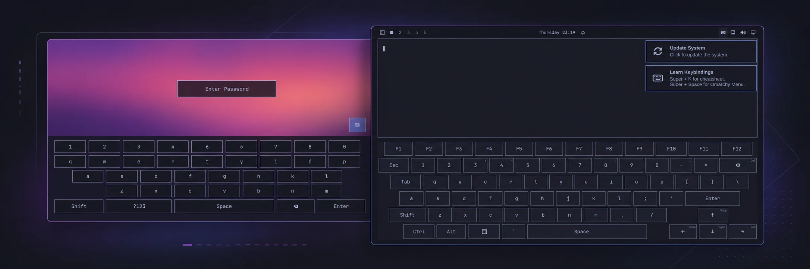

# Omarchy On-Screen Keyboard

[](https://github.com/tcballard/omarchy-badges)



The plugin provides the desktop keyboard shown on the right. The trusted lock-screen keyboard on the left ships with Omarchy itself.

A touch-first keyboard for Omarchy. Open it from the bar, type into the application that already has focus, and use normal application and Omarchy shortcuts without reaching for a physical keyboard. An optional, separately installed SDDM theme adds touch input to the login screen.

## Requirements

- An Omarchy release with Quattro shell-plugin support.
- Omarchy's standard `base-devel`, `wayland`, and `libxkbcommon` packages. The plugin uses them to build its small input helper locally; it downloads nothing and needs no root access for desktop use.
- `jq` for the optional SDDM installer and status commands.

The plugin runs unsandboxed inside the long-lived `omarchy-shell` process. Review the source before enabling it, as you should for any third-party shell plugin.

## Install

```bash
omarchy plugin add https://github.com/mtolhuys/omarchy-onscreen-keyboard.git --enable
```

The keyboard icon is placed on the right side of the bar by default. Installation does not run a setup hook or change system files.

## Use

Tap or left-click the keyboard icon to show or hide the keyboard. The icon is bright while the keyboard is visible and dim while it is hidden. On supported detachable hardware, an actual attach or detach transition also hides or shows it.

The keyboard includes letters, numbers, common punctuation, function and navigation keys, and one-shot Ctrl, Alt, Shift, and Super modifiers. Tap a modifier and then a key to send a chord. Hold a key with a small corner hint to open its alternatives.

Scripts can use the same direct controls:

```bash
omarchy-shell onscreen-keyboard show
omarchy-shell onscreen-keyboard hide
omarchy-shell onscreen-keyboard toggle
omarchy-shell onscreen-keyboard status
```

## Optional login-screen keyboard

Desktop use needs no root access. Login-screen support is a separate, explicit system integration that replaces the active SDDM theme with the bundled keyboard-enabled theme:

```bash
PLUGIN_DIR="$HOME/.config/omarchy/plugins/io.github.mtolhuys.onscreen-keyboard"
sudo "$PLUGIN_DIR/bin/install-login-keyboard"
"$PLUGIN_DIR/bin/login-keyboard-status"
```

Log out to test it. Rebooting also shows it when SDDM autologin is disabled. Encrypted Omarchy installations normally keep autologin enabled because disk encryption is the boot authentication boundary, so a normal reboot may skip the greeter.

The installer:

- writes `/usr/share/sddm/themes/omarchy-onscreen-keyboard` and `/etc/sddm.conf.d/99-z-omarchy-onscreen-keyboard.conf`;
- does not restart SDDM, access the network, edit Omarchy's packaged theme, or change autologin;
- records hashes for every owned file and refuses to replace locally modified owned files unless `--force` is supplied.

The login theme follows Omarchy's standard single-user behavior and signs in `userModel.lastUser`. It edits only SDDM's password model and submits through the SDDM API; the desktop virtual-keyboard helper is never used at the login screen.

Plugin updates do not silently rewrite system files. After an update, check and refresh the optional integration explicitly:

```bash
"$PLUGIN_DIR/bin/login-keyboard-status"
sudo "$PLUGIN_DIR/bin/install-login-keyboard"
```

## Update

```bash
omarchy plugin update io.github.mtolhuys.onscreen-keyboard
```

## Remove

If you installed the optional login-screen integration, remove it **before** removing the plugin checkout so its uninstaller is still available:

```bash
PLUGIN_DIR="$HOME/.config/omarchy/plugins/io.github.mtolhuys.onscreen-keyboard"
sudo "$PLUGIN_DIR/bin/uninstall-login-keyboard"
omarchy plugin remove io.github.mtolhuys.onscreen-keyboard
```

If you never installed the login-screen integration, only the final command is needed. Install and uninstall both preserve unrelated files and stop on locally modified owned files; use `--force` only after inspecting the reported paths.

The compiled helper is ordinary disposable cache data under `~/.cache/omarchy-onscreen-keyboard/` (or `$XDG_CACHE_HOME/omarchy-onscreen-keyboard/`) and is not deleted automatically by Omarchy's plugin removal command.

### Migrating from the pre-marketplace build

Versions through 0.2.1 used the temporary ID `dev.omarchy.onscreen-keyboard`. Remove any optional login integration with that checkout's uninstaller, remove the old plugin, and then use the install command above. The marketplace ID is now permanently namespaced to this GitHub account.

## Security boundaries and limitations

- The current layout and injected XKB keymap are English (US).
- Attach/detach reactions are confirmed on the ASUS ROG Flow Z13 through Hyprland's device inventory. Other devices can always use the bar icon or direct commands.
- The desktop helper is compiled from bundled source into the user's cache. It injects only closed, individual key actions through Wayland's virtual-keyboard protocol and never stores typed strings, uses the clipboard, reads hardware input devices, or requests extra privileges.
- Desktop injection cannot cross into SDDM or the lock screen. Those trusted surfaces use their own direct password-model integrations.
- The lock-screen keyboard belongs to Omarchy itself, not this third-party plugin. Keep Omarchy updated to obtain it.
- The disk-encryption prompt runs before Omarchy, SDDM, or this plugin and is outside this project's scope.
- Floating and fullscreen windows are adjusted when necessary and restored when the keyboard hides. Physical geometry can still vary with display scale and compositor configuration.

See [SECURITY.md](SECURITY.md) for the complete security model and private vulnerability-reporting link.

## Development

The portable test suite uses Bash, Node.js, `jq`, a C compiler, `wayland-scanner`, and the Wayland and xkbcommon development files:

```bash
./bin/test
```

Validate the marketplace manifest with the current Omarchy CLI:

```bash
omarchy plugin validate .
```

The suite runs without a graphical session. Release candidates are additionally exercised in a disposable Omarchy VM for plugin lifecycle, shell reload, pointer interaction, and real Wayland input behavior.

## License

Original project code and documentation are available under the [MIT License](LICENSE). The bundled Wayland protocol definition retains its own permissive copyright notice; see [NOTICE.md](NOTICE.md).
